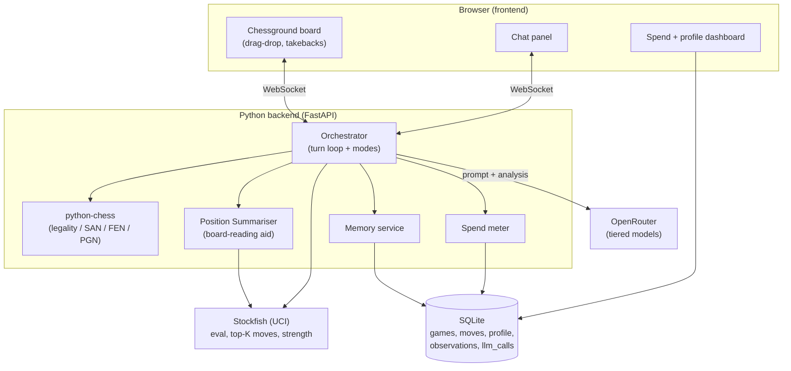

# ChessChamp — a personal AI chess coach

A self-hosted chess teacher: you play, a strong engine keeps the game honest, and an
LLM sits on top as a **coach with a memory of you** — goading, tempting, explaining, and
steadily tuning the challenge to stretch you without crushing you.

Built for one player (you), optionally shown to friends. Local-first, portable to your
Oracle VM later.

---

## 1. The core idea (and the one principle that makes it work)

The single most important design decision:

> **Stockfish is the brain. The LLM is the voice.**

LLMs are charming but genuinely bad at chess — they hallucinate illegal moves, lose the
position, and miscount material. So the LLM is **never** the source of truth for legality
or strength. Instead:

- **Stockfish** decides what is legal, evaluates positions, and defines the _set of
  reasonable moves at a target strength_.
- **The LLM** chooses _among engine-vetted options_ for personality/pedagogical reasons,
  and does all the talking, teaching, goading, and remembering.

This division of labour is what separates a coach that sounds smart from one that
hallucinates. Everything below builds on it.

What this buys you over chess.com:

- A coach that **remembers you across games** — your weaknesses, your tilt triggers, what
  motivates you — and deliberately designs each game around them.
- Real **conversation**, not canned engine lines.
- The ability to **pause a game and drop into a practice position** to demonstrate an idea.
- You own the data, you own the spend, you own the persona.

---

## 2. System architecture



Everything is **backend-authoritative**: the browser board is a nice renderer that
_proposes_ moves; the backend (python-chess) validates them and holds the true game state.
That avoids duplicating chess rules in JavaScript and makes takebacks/practice-mode trivial.

---

## 3. The turn loop

### When it's _your_ turn

```mermaid
sequenceDiagram
    participant You
    participant Orch as Orchestrator
    participant SF as Stockfish
    participant LLM

    You->>Orch: drag a move (or take back)
    Orch->>SF: eval before vs after, best line
    SF-->>Orch: cp-loss, classification, better move
    Note over Orch: If takeback → record it (silent data)
    Orch->>LLM: your move + engine verdict + memory
    LLM-->>Orch: chat (praise / goad / question)<br/>+ observations to store
    Orch-->>You: coach speaks; annotate move
```

### When it's the _coach's_ turn

```mermaid
sequenceDiagram
    participant Orch as Orchestrator
    participant SF as Stockfish
    participant LLM
    participant You

    Orch->>SF: top-K legal moves at target strength<br/>+ find "tempting bad" replies for You
    SF-->>Orch: candidates w/ evals + trap map
    Orch->>LLM: position summary + candidates + memory + goal
    LLM-->>Orch: pick a candidate + chat + optional action
    Note over Orch: validate move ∈ candidates
    Orch->>You: play move; coach taunts/tempts
```

**One LLM call per turn.** The engine analysis is _pre-fetched and injected_ into the
prompt rather than fetched by the LLM through extra round-trips — that keeps latency and
spend down. Discretionary tools (open practice board, change difficulty) are the exception.

---

## 4. The LLM turn contract

Each turn, the LLM receives a compact package and returns structured output (JSON via
tool-calling, so the orchestrator never has to parse prose for the move).

**Input to the LLM (kept deliberately small — see §10 spend):**

```jsonc
{
  "mode": "playing", // playing | practice | review
  "you_are": "black",
  "position": {
    "fen": "r1bqkbnr/pppp1ppp/2n5/4p3/2B1P3/5N2/PPPP1PPP/RNBQK2R b KQkq - 3 3",
    "moves_san": ["e4", "e5", "Nf3", "Nc6", "Bc4"], // token-cheap history
    "summary": {/* see §5 — computed, not guessed */},
  },
  "engine": {
    "eval_cp": 25,
    "your_candidates": [
      // legal moves at target strength
      { "san": "Bc5", "eval_cp": 20, "pv": ["Bc5", "c3", "Nf6"] },
      { "san": "Nf6", "eval_cp": 22, "pv": ["Nf6", "Ng5", "d5"] },
      { "san": "Bb4", "eval_cp": 10, "pv": ["Bb4", "c3", "Ba5"] },
    ],
    "their_temptations": [
      // moves YOU might play that look good but aren't
      {
        "san": "Nxe4",
        "looks": "wins a pawn",
        "truth": "loses to Bxf7+ then Qd5",
        "swing_cp": -180,
      },
    ],
  },
  "profile_digest": "1050-ish. Hangs pieces to knight forks. Rushes attacks. Likes being needled but tilts if down two pieces.",
  "goal": "Test whether they spot the f7 weakness this game.",
}
```

**Output from the LLM (tool call):**

```jsonc
{
  "chat": "The Italian again. Bold. Go on then — you see that knight on c6 is doing a lot of work, right? Or are you eyeing my e4 pawn... 👀",
  "move_san": "Bc5", // only on the coach's own turn; must be ∈ candidates
  "observations": [
    // appended to the coach's notebook (memory)
    {
      "text": "Chose the Italian setup as White-equivalent response comfortably.",
      "tags": ["opening"],
    },
  ],
  "action": null, // or {"type":"open_practice_board", ...}
}
```

Tools the LLM can call:

| Tool                                             | Purpose                                                 |
| ------------------------------------------------ | ------------------------------------------------------- |
| `make_move(san)`                                 | Play a move — **validated against the candidate set**   |
| `open_practice_board(fen, objective, narration)` | Interrupt to demonstrate                                |
| `record_observation(text, tags)`                 | Write to the coach's notebook                           |
| `set_difficulty(delta)`                          | Nudge the stretch up/down ("they're tilting, ease off") |
| `give_hint(level)`                               | Escalating hints when you ask                           |

---

## 5. The Position Summariser (the secret sauce)

LLMs read a bare FEN poorly. Before every LLM call, compute an objective, cheap,
**textual description of the position** so the model reasons from facts instead of
hallucinating. This one component is the difference between a coach that sounds
authoritative and one that talks nonsense.

Everything here is computed by code + one Stockfish call — no guessing:

```jsonc
{
  "material": { "white": 39, "black": 37, "balance": "+2 White" },
  "phase": "middlegame",
  "side_to_move": "black",
  "king_safety": { "white": "castled, intact shield", "black": "king in centre, risky" },
  "hanging": ["black knight on e5 is undefended"],
  "open_files": ["d"],
  "passed_pawns": [],
  "threats": ["Nxe5 wins a pawn", "Qd5 hits f7 and the knight"],
  "eval_trend": [-10, 5, 25, 22], // last few plies
  "last_move_class": "inaccuracy", // best | good | inaccuracy | mistake | blunder
  "best_was": "Nf6",
}
```

`python-chess` gives you material, attackers/defenders (hanging detection), open files,
passed pawns, and phase for free; Stockfish gives eval + threats. Feed this, and the LLM's
chess talk becomes reliable and its token cost drops (it doesn't have to "think" the
position from scratch).

---

## 6. Memory — the working model of _you_

Two layers, deliberately kept distinct:

**A. Objective stats (computed by code — never hallucinated):**

- Estimated Elo overall + per phase (opening / middlegame / endgame).
- Blunder taxonomy: how often you hang to forks, miss back-rank, drop pins, overextend.
- Behaviour: takeback frequency and _when_ (tactical positions? when behind?).
- Opening tendencies: what you reach for, what you handle badly.

**B. The Coach's Notebook (natural language, written by the LLM):**

- Free-text observations after key moments and games ("Rushes the attack the moment they
  smell blood — sacrificed a sound bishop on h7 on move 19 again").
- What motivates you, what tilts you, tone that lands.
- Stated goals ("wants to break 1200", "hates endgames").

**How it's used without blowing the token budget:** you never feed the whole history. Each
game you inject a compact **profile digest** (a few hundred tokens) — the structured stats
plus the top-N most salient, most recent notebook lines. Periodically the LLM
**consolidates** the notebook (merges duplicates, drops stale notes) — the same
memory-hygiene pattern good agents use.

The loop that makes it feel alive:

```
diagnose (stats + notebook)  →  prescribe (design this game's goal)
        →  test (steer openings toward your weakness)  →  observe  →  update
```

Example: if you're weak in isolated-queen-pawn positions, the coach — as your opponent —
can _choose openings that produce IQP structures_, then note whether you handled it. That
closes the loop from "spotting a weakness" to "re-testing it later," i.e. spaced repetition
of your actual failings.

---

## 7. Adaptive difficulty — "stretch, don't crush"

Maintain a live estimate of your strength (inferred from move quality, the way chess.com
estimates a rating). Set the opponent's strength to **your estimate + a stretch factor**
(e.g. +100–200 Elo), modulated by the pedagogical goal and your emotional state.

Stockfish strength knobs:

- `UCI_LimitStrength` + `UCI_Elo` (~1320–3190) — cleanest.
- `Skill Level` 0–20.
- Node/depth/movetime limits.
- Or analyse at full strength and **select a human-like move from the top-K** — often more
  natural than very low `UCI_Elo`, which can produce weird random lunges.

The coach can override per-move: play _below_ strength to let you execute a plan you're
learning, or pick a sharp line to punish a specific recurring sin. The LLM nudges the dial
via `set_difficulty` ("they've won three in a row and sound bored — crank it").

---

## 8. Teaching mechanics (the fun part)

These are concrete, engine-backed features — not vibes:

- **Goading / tempting.** Before your move, Stockfish evaluates _your_ tempting options and
  flags "poisoned" ones (look good — win a pawn — but lose to a tactic). The coach dangles
  them: _"That b2 pawn's just sitting there. I'd take it. Would you?"_ Teaches you to
  distrust free material.
- **Trap-setting.** The coach can knowingly pick a move that sets a trap you _should_ learn
  to see, from its legal candidate set — then congratulate or pounce.
- **On-demand explanation.** Ask "why did you play that?" or "what should I be thinking
  here?" and get an answer grounded in the engine lines, not vibes.
- **Practice-board interrupt.** The coach decides a moment is teachable, calls
  `open_practice_board(fen, objective)`, the UI swaps to a scratch position ("mate this king
  with rook and king"), guides you with Stockfish, then returns to the paused main game.
  Requires a small **mode stack**: `push(practice)` → do it → `pop()` back to the real game.
- **Forgiving board with recorded takebacks.** Take moves back freely; each takeback is
  logged silently (position, what you were escaping) and becomes teaching material:
  _"You've reeled that knight move back three times — knights on the rim keep haunting you."_
- **Post-game review.** One cheap LLM call over the engine-annotated PGN produces a
  narrative keyed to your profile: _"Classic you — winning position on move 18, then you
  couldn't resist the attack."_

---

## 9. Modes

The orchestrator is a small state machine:

| Mode       | What happens                                                        |
| ---------- | ------------------------------------------------------------------- |
| `PLAYING`  | The main game loop (§3).                                            |
| `PRACTICE` | Pushed on top of a paused game; scratch position with an objective. |
| `REVIEW`   | Post-game walk-through; engine annotations + LLM narrative.         |
| `IDLE`     | Menu / new game / profile view.                                     |

Game state is a stack so a practice detour never loses your real game.

---

## 10. Spend control (first-class — you asked, rightly)

OpenRouter is pay-per-token, so treat cost as a design constraint, not an afterthought.

**Instrument from day one.** Log every call (`model, tokens_in, tokens_out, cost, purpose`)
to the `llm_calls` table and show a running total in the UI, per game and per month.

**Keep each call small.** The whole reason for §5's summariser and §6's digest is that
`FEN + SAN list + structured analysis` is _far_ cheaper than making the model reason from
raw board state. A typical turn is ~1–3K tokens in, ~200–500 out.

**Tier your models.** OpenRouter makes swapping models a one-line change:

- **Cheap tier** (small/fast model) for routine move chatter.
- **Strong tier** only for teachable moments and post-game reviews.
- **Skip the LLM entirely** for obvious moves — not every move needs commentary. Comment on
  eval swings, key moments, or when you ask.

**Hard caps.** Set an OpenRouter credit limit and a per-key monthly cap so a bug can't run
away with your wallet. Add a local budget guard that refuses calls past a daily ceiling.

**Prompt caching.** The system prompt + persona + profile digest are stable — cache them
where the provider supports it so you're not re-billed for the same preamble every turn.

**Local tier option.** On the Oracle VM you can run a small local model (via Ollama) for the
cheap tier and reserve OpenRouter for the heavy lifting — or run fully local to start and
add OpenRouter only where quality matters.

**Rough cost intuition** (40-move game, ~40 commented turns):

| Tier                                      | ~tokens/game       | Ballpark                          |
| ----------------------------------------- | ------------------ | --------------------------------- |
| Small model (e.g. cheap OpenRouter model) | ~100K in / 20K out | fractions of a cent → a few cents |
| Mid model                                 | same               | a few cents → ~$0.10              |
| Frontier model, every move                | same               | ~$0.30–1.00                       |

Comment selectively and tier well, and a _month_ of daily games stays in pocket-change
territory. (Verify exact per-model prices on OpenRouter — they change.)

---

## 11. Recommended tech stack

Chosen for local-first, fast to build, great board, trivial to redeploy on the Oracle VM.

| Layer         | Choice                                            | Why                                                                             |
| ------------- | ------------------------------------------------- | ------------------------------------------------------------------------------- |
| Engine        | **Stockfish** (binary) via UCI                    | Free, strongest, tunable strength                                               |
| Rules/FEN/PGN | **python-chess**                                  | Legality, SAN, PGN, _and_ built-in UCI engine driver — kills a mountain of work |
| Backend       | **Python + FastAPI** (WebSockets)                 | Async, simple, pairs perfectly with python-chess                                |
| Board UI      | **Chessground** (Lichess's board) + a thin client | Best-in-class drag-drop board; backend stays authoritative                      |
| Storage       | **SQLite**                                        | One file, zero-ops, perfect for one user                                        |
| LLM           | **OpenRouter** (OpenAI-compatible HTTP)           | One API, many models, easy tiering + caps                                       |

You have Python 3.11 and Node 18 already — this stack runs today. Redeploying to the Oracle
VM is just "run the same web server there."

_(If you'd rather avoid a browser entirely, a Python + PyQt desktop app also works, but the
browser board is nicer and the Oracle VM story is cleaner.)_

---

## 12. Data model (SQLite)

```
profile        one row (you): elo estimates, tendencies, goals, tone prefs, persona dial
games          id, pgn, result, date, opponent_elo, goal, summary
moves          game_id, ply, san, fen_before, eval_before, eval_after,
               cp_loss, classification, was_takeback, seconds_taken
observations   coach's notebook: text, tags, game_id, ply, salience, created_at
lessons        concept, status (queued|active|learned), evidence, last_tested
llm_calls      model, tokens_in, tokens_out, cost, latency_ms, purpose, created_at
```

`moves.was_takeback` + `observations` are what turn "a forgiving board" into "a coach who
notices what you flinch from."

---

## 13. Build plan (start tiny, get value fast)

**Phase 0 — Engine spike (½ day).** `pip install chess`, drop in the Stockfish binary, play a
terminal game vs reduced-strength Stockfish. Prove the engine plumbing.

**Phase 1 — Give it a voice (½ day).** Add OpenRouter. Each move: send the §5 summary +
engine analysis, get chat back. Still terminal. **Measure token cost per game now.**

**Phase 2 — Browser board (1–2 days).** FastAPI + Chessground + chat panel over WebSocket.
Backend-authoritative moves. Forgiving takebacks, recorded.

**Phase 3 — Memory (1–2 days).** SQLite. Persist games, move quality, the coach's notebook.
Inject the profile digest into the next game. Now it _remembers you_.

**Phase 4 — Adaptivity + practice board (2–3 days).** Elo estimation, difficulty dial, the
practice-board interrupt, the lesson queue + spaced re-testing.

**Phase 5 — Polish.** Spend dashboard, model tiering, post-game review, opening steering,
deploy to the Oracle VM.

Each phase is independently useful — you could happily stop after Phase 3 and already have
something chess.com doesn't sell you.

---

## 14. Risks & gotchas (learned the hard way)

- **Never let the LLM be the rules engine or sole move-picker.** Validate every LLM move
  against the engine's legal candidate set. (This is §1 restated because it's the #1 way
  these projects fail.)
- **Feed the position summary, not just the FEN** (§5) — otherwise the coach hallucinates.
- **Very low `UCI_Elo` plays oddly.** Prefer "select a human move from top-K" for a natural
  weak opponent.
- **Instrument spend from the first LLM call**, not after a surprise bill.
- **"Stretch not crush" is a control-loop you'll tune** — expect to fiddle with the stretch
  factor and the tilt heuristics.
- **Latency:** deep Stockfish + a big model per move can feel sluggish. Cap engine
  think-time, pre-fetch analysis, stream the chat.

---

## 15. Getting started on _this_ machine

Concrete next actions, given what's installed (Python 3.11 ✓, Node 18 ✓, git ✓, no
Stockfish yet):

```bash
# 1. Python deps
pip install python-chess fastapi "uvicorn[standard]" httpx python-dotenv

# 2. Get Stockfish (Windows): download the binary from stockfishchess.org,
#    drop stockfish.exe in the repo (or on PATH), note the path.

# 3. An OpenRouter API key in a .env (never commit it), plus a hard spend cap
#    set in the OpenRouter dashboard.
```

Then Phase 0 is a ~40-line script: python-chess opens Stockfish, you type moves, it replies.
That's the whole spine — everything else hangs off it.
